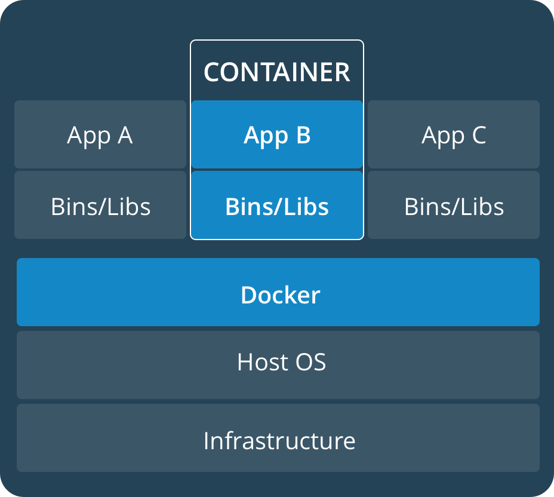
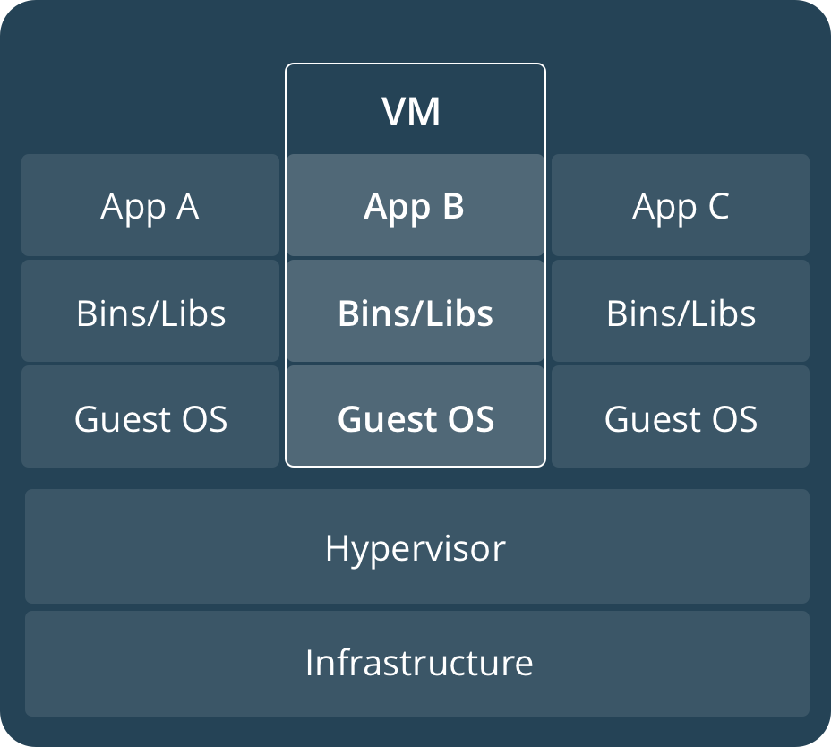

# 1. Orientation and setup

## Docker concepts

Docker is a platform for developers and sysadmins to **develop**, **deploy**, and **run** applications with containers. The use of Linux containers to deploy applications is called _containerization_. Containers are not new, but their use for easily deploying applications is (relatively).

Containerization is increasingly popular because containers are:

 * **Flexible**: Even the most complex applications can be containerized.
 * **Lightweight**: Containers leverage and share the host kernel.
 * **Interchangeable**: You can deploy updates and upgrades on-the-fly.
 * **Portable**: You can build locally, deploy to the cloud, and run anywhere.
 * **Scalable**: You can increase and automatically distribute container replicas.
 * **Stackable**: You can stack services vertically and on-the-fly.

### Images and containers

A container is launched by running an image. An **image** is an executable package that includes everything needed to run an application—the code, a runtime, libraries, environment variables, and configuration files.

A **container** is a runtime instance of an image—what the image becomes in memory when executed (that is, an image with state, or a user process). You can see a list of your running containers with the command `docker ps` just as you would in Linux.

### Containers and virtual machines

A **container** runs _natively_ on Linux and shares the kernel of the host machine with other containers. It runs a discrete process, taking no more memory than any other executable, making it lightweight.

By contrast, a **virtual machine** (VM) runs a full-blown “guest” operating system with virtual access to host resources through a hypervisor. In general, VMs provide an environment with more resources than most applications need.

       

## Prepare your Docker environment

Install the most recent stable version of [Docker Desktop](https://www.docker.com/products/docker-desktop) for your OS.

### Test Docker version

Run `docker --version` and ensure that you have a supported version of Docker:

```bash
$ docker --version

Docker version 19.03.13, build 4484c46d9d
```

Run `docker info` (or `docker version` without `--`) to view even more details about your Docker installation:

```bash
$ docker info

Client:
 Debug Mode: false
Server:
 Containers: 6
  Running: 0
  Paused: 0
  Stopped: 6
 Images: 4
 Server Version: 19.03.13
 Storage Driver: overlay2
 ...
```

> **NOTE**: _To avoid permission errors (and the use of `sudo`), add your user to the `docker` group._


### Test Docker installation

Test that your installation works by running the simple Docker image, [hello-world](https://hub.docker.com/_/hello-world/):

```
$ docker run hello-world

Unable to find image 'hello-world:latest' locally
latest: Pulling from library/hello-world
ca4f61b1923c: Pull complete}
Digest: sha256:ca0eeb6fb05351dfc8759c20733c91def84c...
Status: Downloaded newer image for hello-world:latest
 

Hello from Docker!
This message shows that your installation appears to be 
working correctly.
...
```

List the `hello-world` image that was downloaded to your machine:

```
$ docker image ls
```

List the `hello-world` container (spawned by the image) which exits after displaying its message. The container isn’t running, so you’ll need to use the `--all` option to force Docker to show it in the list. If it were still running, you would not need the `--all` option:

```
$ docker container ls --all

CONTAINER ID    IMAGE         COMMAND     CREATED           STATUS
54f4984ed6a8    hello-world   "/hello"    20 seconds ago    Exited (0) 19 seconds ago
```


## Recap and cheat sheet

```bash
## List Docker CLI commands
docker
docker container --help

## Display Docker version and info
docker --version
docker version
docker info

## Execute Docker image
docker run hello-world

## List Docker images
docker image ls

## List Docker containers (running, all, all in quiet mode)
docker container ls
docker container ls --all
docker container ls -aq
```


### Conclusion of part one

Containerization makes [CI/CD](https://en.wikipedia.org/wiki/CI/CD) seamless. For example:

* applications have no system dependencies
* updates can be pushed to any part of a distributed application
* resource density can be optimized.

With Docker, scaling your application is a matter of spinning up new executables, instead of running heavy VM hosts.

## Next Steps

1. **Orientation and setup** _(you are here)_
2. [Containers](part_2.md)
3. Services and Stacks

