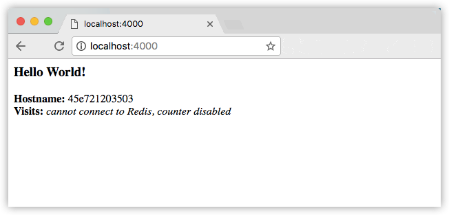

# 2. Containers

## Introduction

It’s time to begin building an app the Docker way. We start at the bottom of the hierarchy of such an app, a *container*, which this section covers. Above this level is a service, which defines how containers behave in production, and covered in part 3. Finally, at the top level is the stack, defining the interactions of all the services, covered in part 4.

* Stack
* Services
* **Container** (you are here)

### Your new development environment

In the past, if you were to start writing a Python app, your first order of business was to install a Python runtime onto your machine. But, that creates a situation where the environment on your machine needs to be perfect for your app to run as expected, and also needs to precisely match your production environment.

With Docker, you can just grab a portable Python runtime as an image, no installation necessary. Then, your build can include the base Python image right alongside your app code, ensuring that your app, its dependencies, and the runtime all travel together.

These portable images are defined by something called a `Dockerfile`.

### Define a container with `Dockerfile`

`Dockerfile` defines what goes on in the environment inside your container. Access to resources like networking interfaces and disk drives is virtualized inside this environment, which is isolated from the rest of your system, so you need to map ports to the outside world, and be specific about what files you want to “copy in” to that environment. However, after doing that, you can expect that the build of your app defined in this `Dockerfile` behaves exactly the same wherever it runs.

### `Dockerfile`

Create an empty directory on your local machine. Change directories (`cd`) into the new directory, create a file called `Dockerfile`, type the following content into that file, and save it. Take note of the comments that explain each statement in your new Dockerfile.

```bash
# Use an official Python runtime as a parent image
FROM python:3.8-slim

# Set the working directory to /app
WORKDIR /app

# Copy the current directory contents into the container at /app
COPY . /app

# Install any needed packages specified in requirements.txt
RUN pip install --trusted-host pypi.python.org -r requirements.txt

# Make port 5000 available to the world outside this container
EXPOSE 5000

# Define environment variable
ENV NAME World

# Run app.py when the container launches  
CMD ["python", "app.py"]
```

This `Dockerfile` refers to a couple of files we haven’t created yet, namely `app.py` and `requirements.txt`. Let’s create those next.


## The app itself

Create two more files, `requirements.txt` and `app.py`, and put them in the same folder with the `Dockerfile`. This completes our app, which as you can see is quite simple. When the above `Dockerfile` is built into an image, `app.py` and `requirements.txt` is present because of the `Dockerfile`'s `COPY` command, and the output from `app.py` is accessible to HTTP thanks to the `EXPOSE` command.


### `requirements.txt`
```
Flask==1.1.2
Redis
```
 
### `app.py`
```python
from flask import Flask
from redis import Redis, RedisError
import os
import socket

# Connect to Redis
redis = Redis(host="redis", db=0, socket_connect_timeout=2, socket_timeout=2) 

app = Flask(__name__)

@app.route("/")
def simple_hello():
    return "Hello, World!"

@app.route("/name")
def custom_hello():
    greet = os.getenv("NAME", "world")
    return f"Hello, {greet}!"

@app.route("/status")
def redis():
    try:
        visits = redis.incr("counter")
    except RedisError:
        visits = "<i>cannot connect to Redis, counter disabled</i>"

    html = "<h3>Hello {name}!</h3>" \
           "<b>Hostname:</b> {hostname}<br/>" \
           "<b>Visits:</b> {visits}"

    return html.format(
        name=os.getenv("NAME", "world"), 
        hostname=socket.gethostname(), 
        visits=visits
    )

if __name__ == "__main__":
    app.run(host='0.0.0.0', port=5000)
```
 
Now we see that `pip install -r requirements.txt` installs the Flask and Redis libraries for Python, and the app prints the environment variable `NAME`, as well as the output of a call to `socket.gethostname()`. Finally, because Redis isn’t running (as we’ve only installed the Python library, and not Redis itself), we should expect that the attempt to use it here fails and produces the error message.

> **NOTE**: _Accessing the name of the host when inside a container retrieves the container ID, which is like the process ID for a running executable._

That’s it! You don’t need Python or anything in `requirements.txt` on your computer, nor does building or running this image install them on your computer. It doesn’t seem like you’ve really set up an environment with Python and Flask, but you have.


### Build the app

We are ready to build the app. Make sure you are still at the top level of your new directory. Here’s what ls should show:

```bash
$ ls

Dockerfile       app.py            requirements.txt
```
 
Now run the `build` command. This creates a Docker image, which we’re going to name using the `--tag` option. Use `-t` if you want to use the shorter version of this option:

```bash
$ docker build . --tag=friendlyhello
```

  or

```bash
$ docker build . -t friendlyhello
```

> **NOTE**: _Don't forget the dot character (`.`) hiding in the middle! That's the argument to tell the build command to look into the current folder for the build instructions (i.e., the `Dockerfile`)._

So where is the image that your command just built? It’s in your machine’s local Docker image registry:

```
$ docker image ls

REPOSITORY            TAG                 IMAGE ID
friendlyhello         latest              326387cea398
```

Note how the tag defaulted to `latest`. The full syntax for the tag option to specify version info would be something like `--tag=friendlyhello:v0.1`.

### Run the app

Now it's time to run the app, mapping your host machine’s port 80 to the container’s published port 5000 using the `-p` option:

```
$ docker run -p 80:5000 friendlyhello
```
 
You should see a message that Python is serving your app at `http://0.0.0.0:5000`. But that message is coming from inside the container, which doesn’t know you mapped port 5000 of that container to port 80 on the host. This means that the correct URL you should use to test your new app is `http://localhost:80` (or more commonly, simply `http://localhost/`).

Go to that URL in a web browser to see the display content served up on a web page:



You can also use the curl command in a shell to view the same content.

```bash
$ curl http://localhost

<h3>Hello World!</h3><b>Hostname:</b> 8fc990912a14<br/><b>Visits...
```

Let's recap: `docker build` creates a Docker _image_, and `docker run` takes an image and runs it, which creates a _container_.

This port remapping of 80:5000 demonstrates the difference between `EXPOSE` within the `Dockerfile` and what the publish value is set to when running `docker run -p`. In future steps in this tutorial, make sure to map port 80 on your host system (usually your laptop) to port 5000 on the container and use [http://localhost/](http://localhost/) to view your app.

> **NOTE**: _You can think about port mapping like port forwarding on your home internet router. Your router at home probably creates a [NAT](https://en.wikipedia.org/wiki/Network_address_translation#One-to-many_NAT) subnet inside your house, so all the devices in the network have [private IP addresses](https://datatracker.ietf.org/doc/html/rfc1918), but to the outside world, they all appear to be the same external address. This is what is happening with Docker, too. The Docker host creates a private network for each container, and hides them from the outside world. In order to see anything happening inside one of those containers from "outside" the private network, you need to create a mapping from the Docker host (your laptop) down into one of those private networks. That's what the `-p` option does._

Hit `CTRL+C` in your terminal to quit the running container.

Now let’s run the app in the background, in detached mode:

```
$ docker run -d -p 80:5000 friendlyhello
```
 
You get the long container ID for your app and then are kicked back to your terminal. Your container is now running in the background. You can also see the abbreviated container ID with `docker container ls` (and both work interchangeably when running commands):

```
$ docker container ls

CONTAINER ID       IMAGE              COMMAND             CREATED
1fa4ab2cf395       friendlyhello      "python app.py"     28 seconds ago
```

Notice that **CONTAINER ID** matches what’s on [http://localhost](http://localhost) (the value won't be the same as what is shown here on this page, but your two values should match).

Now use `docker container` stop to end the process, using the **CONTAINER ID**, like so:

```
$ docker container stop 1fa4ab2cf395
```

## Share your image
To demonstrate the portability of what we just created, let’s upload our built image and run it somewhere else. After all, you need to know how to push to registries if you want to deploy containers to production.

A *registry* is a collection of repositories, and a repository is a collection of images—sort of like a GitHub repository, except the code is already built. An account on a registry can create many repositories. The docker CLI uses Docker’s public registry by default.

> **NOTE**: _We use Docker’s public registry here just because it’s free and pre-configured, but there are many public ones to choose from, and you can even set up your own private registry using [Docker Registry](https://docs.docker.com/registry/)._

### Log in with your Docker ID

If you don’t have a Docker account, sign up for one at [hub.docker.com](https://hub.docker.com/). Make note of your username.

Next, sign in to the Docker public registry on your local machine:

```
$ docker login
```
 

### Tag the image

The notation for associating a local image with a repository on a registry is `username/repository:tag`. The tag is optional, but recommended, since it is the mechanism that registries use to give Docker images a version. Give the repository and tag meaningful names for the context, such as `docker-tutorial:part2`. This puts the image in the `docker-tutorial` repository and tags it as `part2`.

Now, put it all together to tag the image. Run `docker tag <image>` with your username, repository, and tag names so that the image uploads to your desired destination. The syntax of the command is:

```
$ docker tag <image> username/repository:tag
```
 
For example:

```
$ docker tag friendlyhello andem/docker-tutorial:part2
```

Now use `docker image ls` to see your newly tagged image:

```
$ docker image ls

REPOSITORY             TAG             IMAGE ID            CREATED             SIZE
friendlyhello          latest          d9e555c53008        3 minutes ago       195MB
andem/docker-tutorial  part2           d9e555c53008        3 minutes ago       195MB
python                 3.8-slim        1c7128a655f6        5 days ago          183MB
  ...
```

### Publish the image

Now it's time to actually upload your tagged image to the repository (make sure you've signed in to Docker Hub with docker login!)

```
$ docker push <username>/docker-tutorial:part2
```

Once complete, the results of this upload are publicly available. If you log in to [Docker Hub](https://hub.docker.com/), you see the new image there, with its pull command.


### Pull and run the image from the remote repository

From now on, you can use docker run to run your app on any machine with this command:

```
$ docker run -p 80:5000 <username>/docker-tutorial:part2
```
 
If the image isn’t already available locally on the machine, Docker pulls it from the repository:

```
$ docker run -p 80:5000 andem/docker-tutorial:part2

Unable to find image 'andem/docker-tutorial:part2' locally
part2: Pulling from andem/docker-tutorial
10a267c67f42: Already exists
f68a39a6a5e4: Already exists
9beaffc0cf19: Already exists
3c1fe835fb6b: Already exists
4c9f1fa8fcb8: Already exists
ee7d8f576a14: Already exists
fbccdcced46e: Already exists
Digest: sha256:0601c866aab2adcc6498200efd0f754037e909e5fd42069adeff72d1e2439068

Status: Downloaded newer image for andem/docker-tutorial:part2
 * Running on http://0.0.0.0:5000/ (Press CTRL+C to quit)
```
 
No matter where docker run executes, it pulls your image, along with Python and all the dependencies from `requirements.txt`, and runs your code. It all travels together in a neat little package, and you don’t need to install anything on the host machine for Docker to run it.


### Conclusion of part two

That’s all for this stage. In the next section, we learn how to scale our application by running this container in a **service**.

 

## Recap and cheat sheet
Here is a list of the basic Docker commands from this page, and some related ones if you’d like to explore a bit before moving on.

```bash
docker build -t friendlyhello .  # Create image using this directory's Dockerfile

docker run -p 80:5000 friendlyhello  # Run "friendlyname" mapping port 80 to 5000

docker run -d -p 80:5000 friendlyhello         # Same thing, but in detached mode

docker container ls                                 # List all running containers

docker container ls -a              # List all containers, even those not running

docker container stop <hash>            # Gracefully stop the specified container

docker container kill <hash>          # Force shutdown of the specified container

docker container rm <hash>         # Remove specified container from this machine

docker container rm $(docker container ls -a -q)          # Remove all containers

docker image ls -a                              # List all images on this machine

docker image rm <image id>             # Remove specified image from this machine

docker image rm $(docker image ls -a -q)    # Remove all images from this machine

docker login              # Log in this CLI session using your Docker credentials

docker tag <image> username/repository:tag   # Tag <image> for upload to registry

docker push username/repository:tag             # Upload tagged image to registry

docker run username/repository:tag                    # Run image from a registry

```

## Next Steps

1. [Orientation and setup](part_1.md)
2. **Containers** _(you are here)_
3. Services and Stacks
